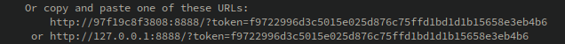

<h3> Running this Notebook and project </h3>

---
<h4> Notebook </h4>

<h5> Using Docker </h5>

From the project's root directory run:
```sh
docker build --tag microwave_tsouros .   # Might require sudo
docker run -p 8888:8888 -t microwave_tsouros  # Port forwarding to a local ip is required to access the nb.
```
From the terminal output, click the link provided (pointing to localhost) by jupyter containing the token:



<h5> Without Docker </h5>

From the project's root directory run (preferrably in a virtual environment):
```sh
pip install -e .[pres]
```
When the installation finishes, the notebook can be run with:
```sh
jupyter notebook TsourosReportEM.ipynb
```
***

<h4> Project </h4>

Run the simulation without accessing the notebook. Defaults to 915MHz if no arguments are provided (with the `-f/--frequency` flag).

<h5> Using Docker </h5>

From the project's root directory run:
```sh
docker build --tag microwave_tsouros .   # Might require sudo
docker run -t microwave_tsouros mic [-f/--frequency 915/2450]
```

<h5> Without Docker </h5>

From the project's root directory (preferrably in a virtual environment):
```sh
pip install -e .
mic [-f/--frequency 915/2450]
# OR
python micwave/src/main.py [-f/--frequency 915/2450]
```
